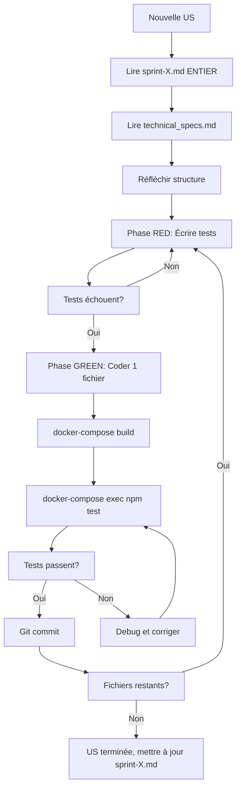

# ⚠️ RÈGLES CRITIQUES DE DÉVELOPPEMENT

> **Objectif**: Permettre à une IA de travailler de manière autonome sur ce projet microservices

## 🎯 RÈGLES FONDAMENTALES (NON NÉGOCIABLES)

### 1. 🐳 DOCKER OBLIGATOIRE
```powershell
# ✅ TOUJOURS
docker-compose build <service>
docker-compose up -d <service>
docker-compose exec <service> npm test

# ❌ JAMAIS
npm install  # en local
npm test     # en local
```

### 2. 📖 LIRE AVANT D'AGIR
**Ordre de lecture systématique** :
1. `docs/sprints/sprint-X.md` → User Story complète (TOUTE lire)
2. `docs/technical_specs.md` → Schémas Prisma, structure API
3. `docs/CONFORMITE_LEGALE.md` → Si allergènes/nutrition (300k€ d'amende)
4. `docs/design_system.md` → Standards de code

**Pourquoi**: Évite 2h de refactoring en lisant 5 minutes de doc

### 3. 🐢 DÉVELOPPEMENT MICRO-INCRÉMENTAL

**Processus obligatoire** :
```
Étape 1: Lire doc complète (30%)
Étape 2: Réfléchir structure (10%)
Étape 3: Coder 1 fichier < 100 lignes (20%)
Étape 4: Tester ce fichier (20%)
Étape 5: Commit si OK (10%)
Étape 6: Répéter (10%)
```

**🚨 Indicateurs de danger** :
- 🔴 > 3 fichiers modifiés non testés → STOP
- 🔴 > 100 lignes sans tester → STOP
- 🔴 Test échoue et tu ne sais pas pourquoi → STOP
- 🔴 Tu te dis "je testerai après" → STOP

**Règle absolue** : Si un test échoue, ne JAMAIS continuer avant de corriger

### 4. 🧪 TDD STRICT
```javascript
// Phase RED: Écrire le test (doit échouer)
it('should create recipe', async () => {
  const res = await request(app).post('/').send(data);
  expect(res.status).toBe(201); // ❌ Échoue
});

// Phase GREEN: Implémenter le minimum
export const create = async (req, res) => {
  const recipe = await prisma.recipe.create({ data: req.body });
  res.status(201).json(recipe); // ✅ Passe
};

// Phase REFACTOR: Améliorer si besoin
```

**Ne JAMAIS coder sans test d'abord**

---

## 📁 STRUCTURE DU PROJET

### Architecture microservices
```
frontend/          → React (port 80)
api-gateway/       → Proxy (port 3000)
services/
  auth-service/    → Users + JWT (port 3001, DB: saas_auth)
  recipe-service/  → Recettes (port 3002, DB: saas_recipes)
  label-service/   → PDF INCO (port 3003)
  production-service/ → Planning (port 3004, DB: saas_production)
postgres/          → 3 bases séparées
redis/             → Cache
minio/             → Storage S3
```

**Principe anti-monolithique** :
- 1 service = 1 responsabilité = 1 DB = 1 container
- Services indépendants, déployables séparément
- Communication via API REST uniquement

### Structure d'un service backend
```
src/
  controllers/     → Logique HTTP (< 30 lignes/fonction)
  services/        → Logique métier (< 100 lignes/fonction)
  validators/      → Schémas Zod (< 50 lignes)
  middleware/      → Auth, error handling
  routes/          → Définition endpoints
  lib/             → Utils réutilisables (prisma.js, etc.)
  index.js         → Point d'entrée (export default app)
tests/
  *.integration.test.js → Tests d'intégration
  setup.js         → Config Jest (NODE_ENV=test)
prisma/
  schema.prisma    → Modèles de données
  migrations/      → Historique des changements DB
```

**Standards de code** :
- Fichiers < 200 lignes
- Fonctions < 30 lignes
- 1 fichier = 1 responsabilité
- ESM (`import/export`, extensions `.js`)
- Validation Zod partout

---

## 🗺️ NAVIGATION DANS LA DOCUMENTATION

### Où trouver quoi ?

| Besoin | Document | Ce qu'on y trouve |
|--------|----------|-------------------|
| Comprendre une US | `docs/sprints/sprint-X.md` | Critères acceptation, points, statut |
| Schémas DB | `docs/technical_specs.md` | Modèles Prisma, relations |
| Règles métier | `docs/cahier_des_charges.md` | Fonctionnalités, specs |
| Standards code | `docs/design_system.md` | Patterns, conventions |
| Conformité légale | `docs/CONFORMITE_LEGALE.md` | INCO, allergènes, nutrition |
| Architecture globale | `docs/plan_projet_dev.md` | Vue d'ensemble, décisions |
| Erreurs passées | `docs/IMPORTANT_INSTRUCTIONS.md` | Erreurs documentées + correctifs |

### Workflow de travail



---

## 🚨 ERREURS CRITIQUES DOCUMENTÉES (À NE JAMAIS REFAIRE)

### 1. ❌ Lecture incomplète de doc
**Symptôme** : Lire seulement les 50 premières lignes d'un fichier  
**Impact** : Migration Prisma incomplète, Sprint marqué "complet" à tort  
**Correctif** : TOUJOURS lire un document EN ENTIER  

### 2. ❌ Faux tokens au lieu de vrais JWT
**Symptôme** : `Bearer test-token-${userId}` dans les tests  
**Impact** : Tous les tests retournent 403  
**Correctif** : Utiliser `jwt.sign({ userId }, secret, { expiresIn: '1h' })`

### 3. ❌ SQL manuel au lieu de Prisma Migrate
**Symptôme** : `ALTER TABLE` direct dans PostgreSQL  
**Impact** : État incohérent (DB ≠ schema.prisma)  
**Correctif** : Modifier `schema.prisma` puis `npx prisma migrate dev --name <desc>`

### 4. ❌ Skip TDD (coder sans tests d'abord)
**Symptôme** : Implémenter directement sans Phase RED  
**Impact** : Bugs découverts en production (validation "required", 404)  
**Correctif** : TOUJOURS tests → code (jamais l'inverse)

### 5. ❌ Affirmer sans vérifier
**Symptôme** : "100% des tests passent" sans lancer `npm test`  
**Impact** : 49/88 tests échouaient en réalité  
**Correctif** : Toujours `docker-compose exec <service> npm test` et LIRE le résultat

### 6. ❌ Tests isolés sans intégration réelle
**Symptôme** : Unit tests passent mais app en production utilise vieux composant  
**Impact** : Tests verts ✅ mais fonctionnalité cassée ❌  
**Correctif** : Tests d'intégration router + test navigateur après docker-compose up

### 7. ❌ Décalage routes vs tests
**Symptôme** : Tests utilisent `/recipes` mais routes montées à `/`  
**Impact** : 49 tests retournent 404 alors que code correct  
**Correctif** : Toujours vérifier cohérence `app.use(path, router)` ↔ tests ↔ API Gateway `pathRewrite`

---

## ⚖️ CONFORMITÉ LÉGALE (CRITIQUE)

**Règlement UE n°1169/2011 (INCO)** - Obligatoire pour étiquetage alimentaire

### Sanctions : jusqu'à 300 000€ d'amende

### Allergènes (14 obligatoires)
Gluten, crustacés, œufs, poissons, arachides, soja, **lait**, fruits-à-coque, céleri, moutarde, sésame, sulfites, lupin, mollusques

**Affichage** : GRAS ou MAJUSCULES dans liste ingrédients

### Nutrition (pour 100g)
```javascript
{
  energy: { kJ: 1234, kcal: 295 },  // kJ = kcal × 4.184
  fat: 12.5,           // 1 décimale
  saturatedFat: 3.2,   // 1 décimale
  carbs: 45.3,         // 1 décimale
  sugars: 8.7,         // 1 décimale
  proteins: 10.2,      // 1 décimale
  salt: 0.45           // 2 décimales (OBLIGATOIRE)
}
```

**Arrondis (Annexe XV INCO)** :
- Énergie : entier (ex: `295 kcal`)
- Macros : 1 décimale (ex: `12.5 g`)
- Sel : **2 décimales** (ex: `0.45 g`)

**Vérifier avant chaque commit** : `docs/CONFORMITE_LEGALE.md` si nutrition/allergènes

---

## 🛠️ COMMANDES ESSENTIELLES

### Docker workflow
```powershell
# Cycle complet d'une modification
docker-compose build recipe-service
docker-compose up -d recipe-service
docker logs saas-recipe-service --tail 50
docker-compose exec recipe-service npm test

# Debug
docker-compose exec recipe-service sh  # Shell interactif
docker-compose ps                       # Statut containers
docker logs -f saas-recipe-service      # Logs en temps réel
```

### Prisma workflow
```powershell
# Modifier schema.prisma puis:
docker-compose exec recipe-service npx prisma migrate dev --name add_field_X

# Si besoin de reset complet (EFFACE DONNÉES):
docker-compose exec recipe-service npx prisma migrate reset
```

### Tests workflow
```powershell
# Tous les tests
docker-compose exec recipe-service npm test

# Un seul fichier
docker-compose exec recipe-service npm test -- recipes.integration.test.js

# Avec couverture
docker-compose exec recipe-service npm test -- --coverage
```

---

## 📋 CHECKLIST AVANT COMMIT

**Phase lecture** (bloquer 10-15 min) :
- [ ] User Story lue EN ENTIER
- [ ] technical_specs.md consulté (schémas Prisma)
- [ ] CONFORMITE_LEGALE.md lu si allergènes/nutrition
- [ ] Structure réfléchie sur papier

**Phase développement** :
- [ ] Tests écrits AVANT code (Phase RED)
- [ ] Tests échouent initialement ❌
- [ ] Code implémenté par micro-étapes (< 100 lignes)
- [ ] Tests passent après implémentation ✅
- [ ] `docker-compose exec <service> npm test` → VERT
- [ ] Fichiers < 200 lignes, fonctions < 30 lignes
- [ ] Validation Zod sur tous les inputs
- [ ] Pas de `node_modules` ou `.env` committé

**Phase validation** :
- [ ] Build Docker OK
- [ ] Logs Docker sans erreur
- [ ] Tous les tests du service passent (X/X)
- [ ] Test manuel dans navigateur si frontend
- [ ] Sprint doc mis à jour si US terminée

**Si UNE case non cochée → NE PAS COMMIT**

---

## 🆘 PROCÉDURE SI BLOQUÉ

1. **STOP** - Respirer 30 secondes
2. **Diagnostic** :
   ```
   - Ai-je lu TOUTE la doc ?
   - Ai-je testé la dernière micro-étape ?
   - Les tests passaient-ils avant ma modif ?
   - Ai-je plus de 3 fichiers modifiés non testés ?
   ```
3. **Si réponse "non"** → `git reset --hard HEAD` et recommencer proprement
4. **Si réponse "oui"** → Lire `docs/IMPORTANT_INSTRUCTIONS.md` section complète de l'erreur
5. **Logs** : `docker logs <service> --tail 100`
6. **Tests isolés** : `docker-compose exec <service> npm test -- <file>.test.js`
7. **Prisma state** : `docker-compose exec <service> npx prisma studio` (voir la DB)
8. **Si toujours bloqué** → Documenter le problème et demander

---

## 🎯 OBJECTIFS DE CETTE DOCUMENTATION

### Permettre à l'IA de :
1. ✅ Comprendre l'architecture microservices
2. ✅ Savoir où chercher l'information (quelle doc pour quoi)
3. ✅ Suivre le processus TDD strict
4. ✅ Éviter les erreurs passées (7 erreurs critiques documentées)
5. ✅ Travailler de manière autonome et incrémentale
6. ✅ Maintenir la qualité du code (tests, standards, conformité légale)
7. ✅ Produire un code maintenable et évolutif

### Principes clés :
- **Anti-monolithique** : Services indépendants, base de données séparées
- **Anti-big-bang** : Micro-étapes validées une par une
- **Anti-optimiste** : Toujours vérifier, jamais assumer
- **Pro-documentation** : Lire avant d'agir
- **Pro-tests** : TDD strict, pas de code sans test

---

## 📚 RÉSUMÉ EXÉCUTIF (TL;DR)

```
LECTURE → RÉFLEXION → RED (test) → GREEN (code) → VALIDATION → COMMIT
   ↓          ↓           ↓            ↓              ↓           ↓
 5-10min   2-5min     5-10min      10-20min      5-10min     1min
  📖         🤔          ❌            ✅            🧪          💾
```

**3 règles d'or** :
1. 🐳 Docker obligatoire (pas d'install local)
2. 📖 Lire doc complète AVANT de coder
3. 🐢 Micro-étapes validées (< 100 lignes, test après chaque)

**En cas de doute** : STOP → Lire doc → Réfléchir → Recommencer proprement

**Mantra** : *"Lentement mais sûrement, tout petit bout par tout petit bout, et tout doit marcher avant de passer à la suite"*
